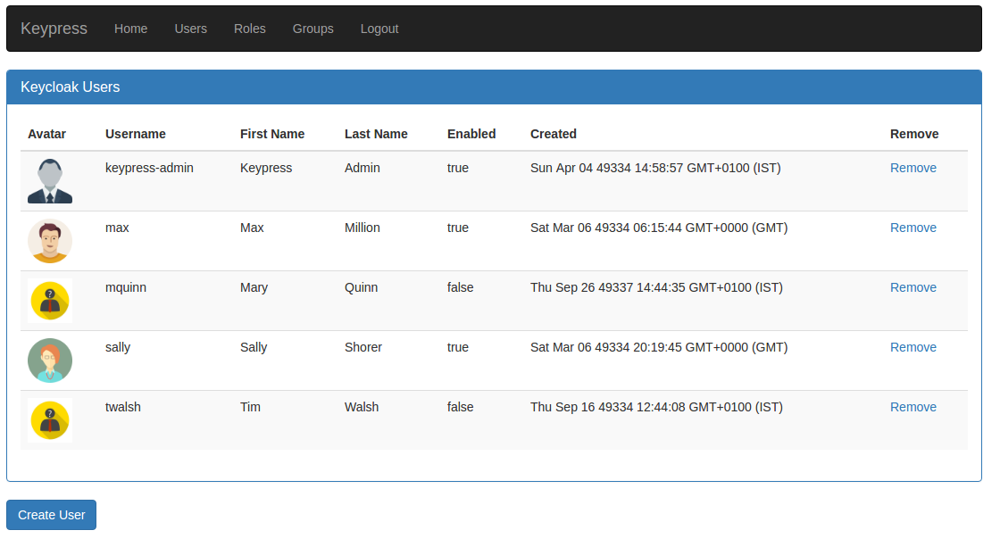

# Keypress

Keypress - Keycloak with Express.

This is a sample application to show how you can use Keycloak with Node.js/Express to provide Access Control in your Application. It has 2 main feature areas:

* Auth/Access Control on Express routes using the Keycloak Node.js Adapter.
* Server Administation using Node.js with the Keycloak Admin Client.

Technologies:
* Node/Express
* keycloak-connect
* keycloak-admin-client
* express-session
* Pug

## Sample UI

## Features
Currently the following functionality is implemented

*Users*
* Create
* Read
* Delete

*Roles*
* Read

*Groups*
* Read

Access Control
Access control for users with the Realm `admin` Role on the following routes:
* /users
* /groups
* /roles

## Requirements

You must have a running Keycloak instance.

## Installation

Clone this repository. Run:

`npm install`

You must then login to Keycloak and Add the Provided Realm and Users.

* Under the Realms section in Keycloak, add a new Realm with the Import option.
* Import the `keypress-realm.json` file located in the `/keycloak` folder.
* Once complete, visit the newly created realm and click the 'Import' button at the bottom left of the sidebar. You will import the users here. Choose the `keypress-users-0.json` file located in the `/keycloak` folder.

Then run the keypress application itself:

`npm start`

The `keypress-admin` users password is `admin`.

How are the Roles, Groups and Users Configured?
* TODO - Create a table with their configurations. Information can be seen in Keycloak anyway.

## Bugs/Issues?
* Open an Issue in GitHub.

